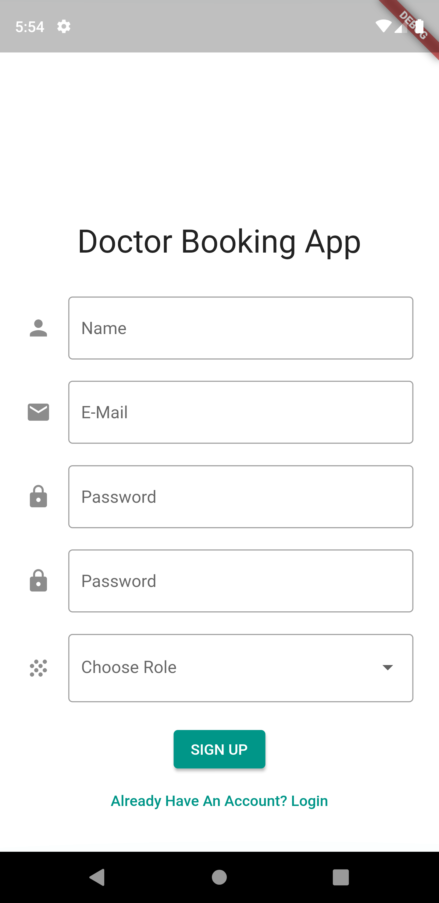

# Doctorbooking

Doctor booking application

## Table of contents

- [Authentication](#authentication)
- [Patient Module](#patient-module)
- [Doctor Module](#doctor-module)
- [Database Module](#database-module)
- [How To Run](#how-to-run)

## Authentication

Screenshots

## Patient Module

Screenshots

## Doctor Module
Screenshots

## Database Module
Screenshots

## How To Run

To run:

- Place googleservices.json found in the email sent in android/app Direcotory

- Run flutter pub-get

- Login details:
  - testdoctor@gmail.com: 12345678
  - testpatient@gmail.com: 12345678
